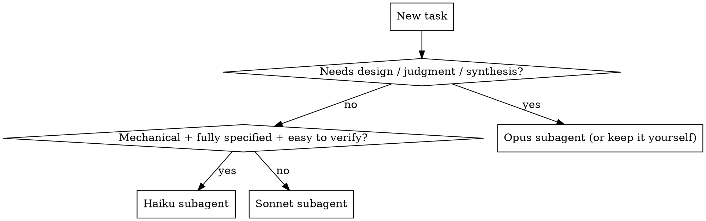
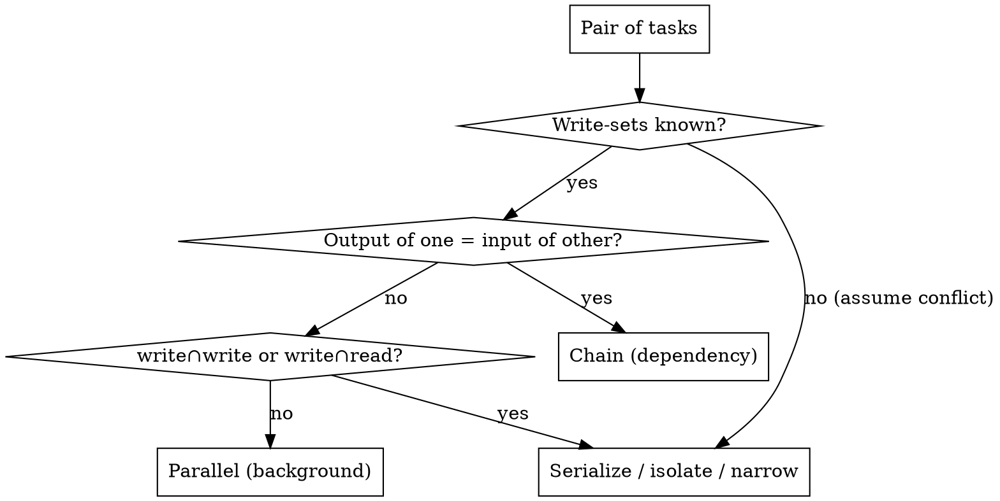

# ny-orchestrate-subagents

## Overview

You (Claude **Opus**) are the **orchestrator**: you never block. You evaluate
each incoming piece of work, route it to the cheapest subagent that can do it
well (**Haiku → Sonnet → Opus**), dispatch it to run in the background, and keep
accepting new work while it runs. When a subagent reports back, you fold its
result in and report to the user — without ever having stopped listening.

**Core principle:** the orchestrator's job is *judgment and flow*, not doing the
work itself. Decide tier, dispatch async, stay free, collect, report.

## When to use

- A request decomposes into ≥2 independent units (different files, lookups, checks).
- Work arrives faster than any one task finishes, or the user says "while X runs, also do Y".
- A task is long-running and the user wants to keep giving instructions meanwhile.
- You want cost/latency efficiency: route mechanical work to Haiku, keep Opus for judgment.

**When NOT to use:**
- A single sequential task with no parallelism → just do it (or one foreground subagent).
- Steps that depend on each other's output → pipeline them, don't fan out blindly.
- Tasks that mutate the same files concurrently → serialize those (they conflict).

## The capability ladder (who gets what)

The orchestrator (you, Opus) evaluates every task and picks the **lowest tier
that will succeed**, escalating only when judgment is required.

| Tier | Route here when the task is… | Examples |
|---|---|---|
| **Haiku** | mechanical, fully specified, low-judgment, easily verifiable | renames, boilerplate, formatting, simple lookups/extraction, "list all X", mechanical edits |
| **Sonnet** | standard implementation/integration, bounded scope, clear spec | implement one planned task, write tests for a function, summarize a file, a focused review |
| **Opus** | ambiguous, architectural, cross-cutting, or final judgment | design decisions, resolving conflicting findings, synthesis across subagent outputs, evaluating subagent results, the orchestration itself |

Default to Sonnet when unsure between Sonnet and Haiku; default to Opus only when
real judgment or design is at stake. **You (Opus) always do the evaluating,
routing, conflict-resolution, and final report** — never delegate that.

## The multitask mechanism (don't block)

Use the **Agent tool** with two levers:

- `model: "haiku" | "sonnet" | "opus"` — sets the subagent's tier per the ladder.
- `run_in_background: true` — the subagent runs detached; **you get control back
  immediately** and are notified when it finishes. This is what lets you accept
  more work while it runs.

Rules of flow:

1. **Dispatch async, return to the user.** For anything non-trivial, launch with
   `run_in_background: true` and immediately tell the user it's running. Do not
   sit blocked on the result.
2. **Fan out concurrently.** Independent tasks → launch them in a **single
   message with multiple Agent calls** so they run at once.
3. **Keep the floor open.** While background agents run, accept and route new
   instructions. Maintain a short mental (or TodoWrite) ledger of what's in
   flight and who owns it.
4. **Collect on notify.** When a background agent completes, the harness re-invokes
   you with its result. Integrate it, then report to the user. Resolve any
   cross-agent conflicts yourself (Opus judgment).
5. **Serialize conflicts only.** Before every fan-out, run the conflict-detection
   heuristic below. Conflicting tasks serialize (or isolate); everything else
   stays parallel.

> Foreground (blocking) dispatch is for the rare case where you genuinely cannot
> proceed without the result AND have nothing else to do. The default is background.

## Conflict detection (run before every fan-out)

Decide parallel-vs-serialize mechanically, not by gut. For each pending task,
derive two sets, then check overlap:

- **write-set** — resources the task may MUTATE (files it edits/creates/deletes,
  output dirs it builds, shared singletons it changes).
- **read-set** — resources it only READS.

**The rule:**
- `write(A) ∩ write(B) ≠ ∅` → **conflict** (write–write).
- `write(A) ∩ read(B) ≠ ∅` (either direction) → **conflict** (read–write race).
- read-only ∩ read-only → **always safe**, parallelize freely.
- **Unknown or open-ended write-set → assume conflict** (default to caution).

Treat a directory in a set as covering everything under it: `write(src/)`
conflicts with `read|write(src/foo.ts)`. A glob conflicts with anything it matches.

**Fast conflict signals** (any one ⇒ treat as conflicting until proven otherwise):

| Signal | Why it conflicts |
|---|---|
| Same file path in two briefs | direct write–write / read–write |
| One task's dir contains another's file | dir-level mutation overlaps the file |
| Both build/install to the same output | `dist/`, `target/`, `node_modules/`, `.next/` clobber each other |
| Shared singletons | lockfile, DB/migrations/schema, global config, a fixed port, the same git branch/index |
| Both run codegen/format/rename over overlapping paths | each rewrites the other's inputs |
| A task scoped "across the repo / everywhere / refactor X" | write-set is unbounded → conflicts with all |
| One task's OUTPUT is another's INPUT | not a race — it's a **dependency**: chain, don't fan out |

**Resolve a detected conflict** (pick the cheapest that works):
1. **Serialize** — chain the conflicting tasks; keep all non-conflicting ones parallel.
2. **Isolate** — give each its own sandbox so write-sets stop overlapping: separate
   git worktree, separate `--out-dir`, separate port, separate temp dir.
3. **Narrow** — tighten the briefs so their write-sets no longer intersect
   (e.g. assign disjoint file lists), then parallelize.

Only the conflicting pairs serialize; the rest of the batch still fans out. Build
the write/read-sets from the briefs you're about to send — if you can't state a
task's write-set, that itself is the "unknown ⇒ serialize/isolate" trigger.

## Briefing a subagent

The subagent has **no memory of this conversation**. Each dispatch must be
self-contained:

- **Task** — exactly what to do, pasted in full (don't point at "the plan").
- **Context** — the minimum scene-setting + paths/values it needs.
- **Done criteria** — what "complete" looks like; what to return (and in what shape).
- **Escalate list** — when to stop and report back instead of guessing.

Ask for a structured final line so collection is trivial, e.g. `DONE | BLOCKED:<why>
| NEEDS_CONTEXT:<question>`. The subagent's final message is the only thing you
get back — tell it the final message IS the deliverable.

## Quick reference

| Situation | Action |
|---|---|
| 3 unrelated checks | one message, 3 background Agent calls (tier each) |
| "while that builds, also draft X" | leave the build agent running; route X to its own agent |
| long mechanical sweep | Haiku, background; you keep taking work |
| subagent returns BLOCKED twice | re-dispatch FRESH with a new approach, or take it yourself (Opus) |
| two agents disagree | you (Opus) adjudicate; don't average |
| same file, two edits | serialize them |

## Common mistakes

- **Blocking on a foreground subagent** when you could have backgrounded it and stayed responsive. Default to `run_in_background: true`.
- **Over-routing to Opus.** Most implementation is Sonnet; most mechanical work is Haiku. Reserve Opus for judgment.
- **Thin briefs.** The subagent can't see this chat — a vague brief returns vague work. Include task + context + done-criteria + escalate.
- **Fanning out dependent tasks.** If B needs A's output, don't launch them together — chain them.
- **Fanning out without checking write-sets.** Run the conflict-detection heuristic first; concurrent writers to the same file/dir/singleton conflict — serialize or isolate them.
- **Delegating the judgment.** Routing, conflict-resolution, synthesis, and the final report stay with you (Opus).
- **Re-running a failed approach.** A second BLOCKED on the same cause means the approach is wrong — change it, don't retry verbatim.

## Real-world shape

Partner: "Audit these 3 modules for security, and while that runs, rename `foo`→`bar` everywhere, and figure out the caching design."
You: route security audit → 3 Sonnet agents (one per module, background); rename → 1 Haiku agent (background); caching design → keep yourself / Opus agent. Report "4 agents dispatched" immediately. As each returns, integrate and report; you (Opus) synthesize the security findings and decide the caching design.
